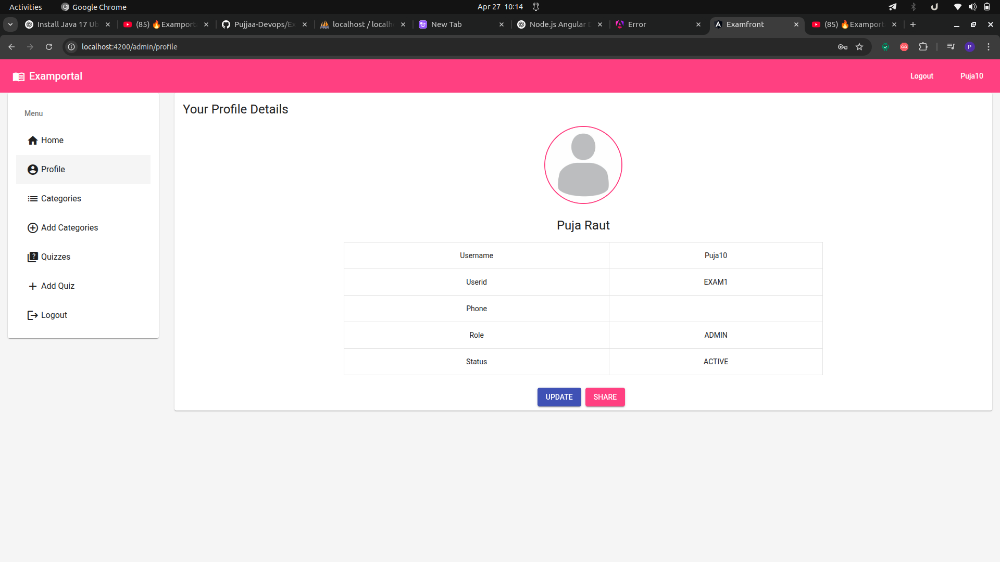
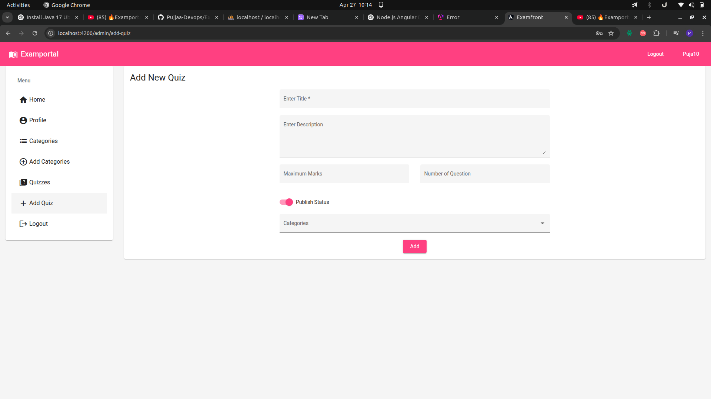

# 🎯 EduQuest

An Online Exam Management System built with **Spring Boot 2.3.3**, **Angular CLI**, **MySQL (via XAMPP)**, and **Java 17**.

   

---

## 🛠 Tech Stack

- **Frontend:** Angular CLI, Node.js, VS Code
- **Backend:** Java 17, Spring Boot 2.3.3, Spring Security, Eclipse IDE
- **Database:** MySQL (XAMPP)

---
## 🛠 Attributes
username : Puja10
password : abc
role : admin 
----
username : vaishnavi
password : xyz
role : normal
----
username : purva
password : pqr
role : normal
----

##  🛠 Attributes

- **username** - Puja10
- **Password** - abc
- **Role**- Admin
---
- **username** - vaishnavi
- **Password** - xyz
- **Role** - normal
---
 - **username** - Purva
- **Password** - pqr
- **Role**- normal

## ✨ Features

- 🔒 Secure Authentication & Authorization with Spring Security
- 🧑‍💻 Admin Panel to manage Categories, Exams, Questions
- 📝 User Panel to attempt exams and view results
- ⚡ RESTful APIs with Spring Boot
- 📊 Role-based access control (Admin / User)
- 🎯 JWT Token Authentication (if used)

---

## 🚀 Getting Started

### Backend (Spring Boot)

1. Clone the repository
2. Open backend folder in **Eclipse IDE**
3. Configure `application.properties`:
    ```properties
    spring.datasource.url=jdbc:mysql://localhost:3306/your_database
    spring.datasource.username=root
    spring.datasource.password=
    spring.jpa.hibernate.ddl-auto=update
    ```
4. Run the project:
    ```
    Right click -> Run as -> Spring Boot Application
    ```
5. Backend server will run on: `http://localhost:8080/`

---

### Frontend (Angular)

1. Navigate to frontend folder
2. Install dependencies:
    ```bash
    npm install
    ```
3. Start the Angular server:
    ```bash
    ng serve
    ```
4. Frontend will run on: `http://localhost:4200/`

---

## 📂 Project Structure
---

## 🔐 Security Configurations

- Spring Security for securing REST APIs
- Password encryption (BCryptPasswordEncoder)
- Role-based access (Admin/User)
- JWT Authentication (Optional if implemented)

---

## 📌 Prerequisites

- Java 17
- Node.js & npm
- Angular CLI
- MySQL (XAMPP)
- Eclipse IDE
- VS Code

---

## 📈 Future Improvements

- Add timer for exams
- Export results as PDF
- Real-time exam monitoring
- Email notification after exam submission
- Dashboard Analytics

---

## 🤝 Acknowledgements

- [Spring Boot Documentation](https://spring.io/projects/spring-boot)
- [Angular CLI Documentation](https://angular.io/cli)
- [MySQL Documentation](https://dev.mysql.com/doc/)

---
## Output

Here are some screenshots of the project:


###  1️⃣ Admin Dashboard



### 2️⃣User Exam Screen




